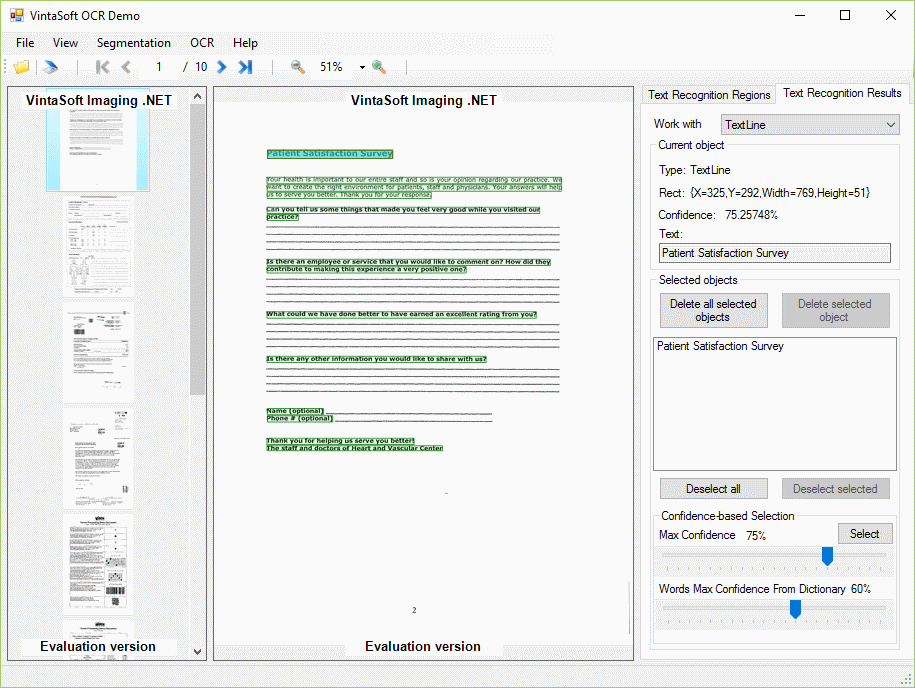

# VintaSoft WinForms OCR Demo

This C# project uses <a href="https://www.vintasoft.com/vsimaging-dotnet-index.html">VintaSoft Imaging .NET SDK</a> and demonstrates how to recognize text in images:
* Load images from file or acquire images from TWAIN scanner.
* Process images before OCR (invert, rotate, binarize, remove noise).
* Segment image before OCR.
* Visualize image segmentation using custom visual tool (RecognitionRegionEditorTool).
* Set OCR settings (select language from about 60 available languages, binarization mode, etc). 
* Recognize text on the whole image or in region of interest. Multithreading is used.
* Recognize MICR or MRZ text on the whole image or in region of interest. Multithreading is used.
* Detect page orientation or determine page layout.
* Visualize and edit OCR results using custom visual tool (OcrResultEditorTool).
* Load recognition results from HOCR file, save recognition results to HOCR file.
* Save OCR results as text file.
* Savie OCR results as searchable PDF document in 2 modes: text only, hidden text over the image.


## Screenshot



## Usage
1. Get the 30 day free evaluation license for <a href="https://www.vintasoft.com/vsimaging-dotnet-index.html" target="_blank">VintaSoft Imaging .NET SDK</a> as described here: <a href="https://www.vintasoft.com/docs/vsimaging-dotnet/Licensing-Evaluation.html" target="_blank">https://www.vintasoft.com/docs/vsimaging-dotnet/Licensing-Evaluation.html</a>

2. Update the evaluation license in "CSharp\MainForm.cs" file:
   ```
   Vintasoft.Imaging.ImagingGlobalSettings.Register("REG_USER", "REG_EMAIL", "EXPIRATION_DATE", "REG_CODE");
   ```

3. Tesseract OCR 5 allows to recognize text in more than 100 languages. This project contains only English dictionary. If you want to recognize not English text, please download not English dictionaries here: <a href="https://www.vintasoft.com/docs/vsimaging-dotnet/Programming-Ocr-Prepare_OCR_engine_for_text_recognition.html" target="_blank">https://www.vintasoft.com/docs/vsimaging-dotnet/Programming-Ocr-Prepare_OCR_engine_for_text_recognition.html</a>.

4. Build the project ("OcrDemo.Net7.csproj" file) in Visual Studio or using .NET CLI:
   ```
   dotnet build OcrDemo.Net7.csproj
   ```

5. Run compiled application and try to recognize text in images.


## Documentation
VintaSoft Imaging .NET SDK on-line User Guide and API Reference for .NET developer is available here: https://www.vintasoft.com/docs/vsimaging-dotnet/


## Support
Please visit our <a href="https://myaccount.vintasoft.com/">online support center</a> if you have any question or problem.
